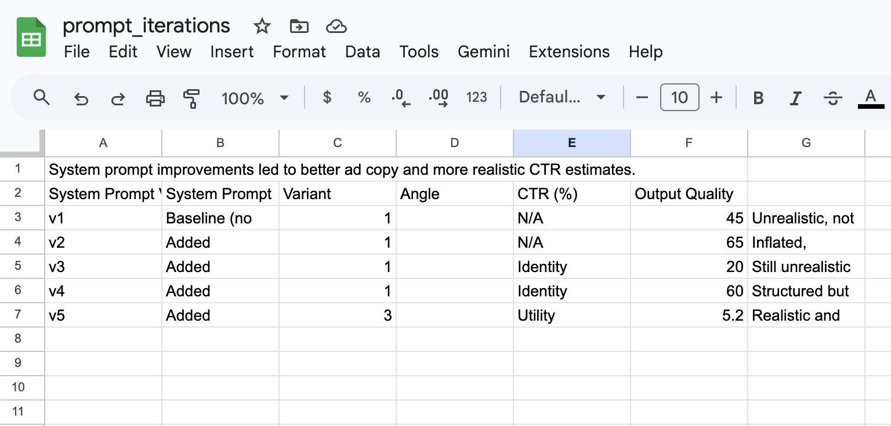

# System Prompt Iteration

## Summary (What changed)

- Early versions (V1–V2) produced generic copy and high CTR estimates (~45–70%)
- Adding structure (V3–V4) improved organization but did not fix generic language or inflated CTR
- Adding constraints (V5: no generic phrases, required specifics, realistic CTR range) resulted in:
  - more concrete language (e.g., "buttery-soft fabric", "coffee run to workout")
  - clearer differences between variants
  - lower, more realistic CTR (~3–5%)

---

## Takeaway

- Without constraints → generic copy + inflated CTR  
- Structure alone → not enough  
- Constraints → changed both output quality and CTR estimates  

---

## Note

The user prompt changed slightly between versions (early versions were more general; later versions included more detail like the brand name).

---

## User prompt

Write three ad copy variants for Luma Active, a small fitness apparel brand 
targeting women ages 25-35. They sell stylish, minimalist workout sets. 
Budget $3k/month, goal is to drive website traffic.  
For each variant include the copy and an estimated CTR probability (0-100%).

---

## V1

System prompt:

"You are an advertising assistant. Write compelling ad copy that gets people to click."

### Output:

1. Ad Copy:
"Take Your Workout Game Up a Notch! Jump into Quality, Comfort, and Style with Our Fitness Apparel, Made just for You! Don't Wait, Discover Now!" CTR Probability: 45%

2. Ad Copy:
"Unleash Your Inner Warrior! Sweat in Style with Our Premium Fitness Collection. Your Perfect Workout Partner is Here, Explore Now!" CTR Probability: 50%

3. Ad Copy:
"Turn Heads at the Gym! Find Your Perfect Fit in Our Exquisite Range of Fitness Gear. Elevate Your Performance, Dive in Today!" CTR Probability: 48%

Result:
- Generic language  
- Repetitive phrasing  
- Inflated CTR (~45–50%)

Why:

This prompt asks for “compelling” copy without constraints or benchmarks. The model assigns high CTR values based on how strong the language sounds, not realistic performance.

---

## V2

System prompt:

"You are a senior advertising strategist with 20 years of experience driving high CTR campaigns for direct-to-consumer brands. Write ad copy that is specific, persuasive, and optimized for clicks."

### Output:

1. Ad Copy:  
"Revamp Your Fitness Wardrobe! Explore premium, stylish, yet comfortable activewear that hugs your body in all the right places. Click to Shop Now & Get 10% Off On Your First Order!"  
Estimated CTR Probability: 65%

2. Ad Copy:  
"Achieve Your Fitness Goals with Confidence! Discover our high-performing fitness attire crafted specifically for the empowered woman. Feel good, look great. Shop Today!"  
Estimated CTR Probability: 60%

3. Ad Copy:  
"Put Fun Back Into Your Fitness Routine! Upgrade your workout gear with our vibrantly colored, breathable fitness apparel. Made for women who move. Click to View Our Collection NOW!"  
Estimated CTR Probability: 55%

Result:
- Slightly more structured  
- Still generic  
- CTR increased further (~55–65%)

---

## V3

System prompt:

"You are a senior advertising strategist with 20 years of experience driving high CTR campaigns for direct-to-consumer brands. You understand that women 25-35 respond to authenticity over hype. You always write copy that leads with an aspiration or desire — never a problem or negative framing. Use clear, direct, positive language and end with a strong call to action. Format your response as three variants, each with the copy and your estimated CTR probability."

### Output:

Variant 1:  
"Tired of workout clothes not living up to their promise? Experience comfort and durability..."  
Estimated CTR: 20%

Variant 2:  
"Ready to smash your fitness goals while still looking stylish?"  
Estimated CTR: 25%

Variant 3:  
"Has finding high-quality, affordable fitness apparel been a struggle?"  
Estimated CTR: 22%

Result:
- More targeted tone  
- CTR dropped (~20–25%)  
- Still somewhat generic  

Observation:
The model did not fully follow the instruction to avoid negative framing ("Tired of...", "struggle"), indicating partial adherence to constraints.

---

## V4

System prompt:

You are a performance marketing expert specializing in high-converting paid social ads for direct-to-consumer brands.

Your goal is to maximize click-through rate (CTR), not brand awareness.

Audience:
Women ages 25–35 who value style, simplicity, and feeling put-together in everyday life — including workouts.

Product:
Minimalist, stylish workout sets from a small brand (Luma Active).

Instructions:
- Write THREE clearly DIFFERENT ad variants, each based on a distinct angle:
  1) Aspirational identity (who she becomes)
  2) Aesthetic/style appeal (how it looks/feels)
  3) Effortless lifestyle convenience

- Each variant MUST include:
  • Headline (short, scroll-stopping)
  • Body copy (1–2 sentences, specific and concrete)
  • CTA (direct and action-oriented)

- Writing rules:
  • Lead with desire or outcome, not problems
  • Avoid clichés and generic phrases (e.g., “feel your best”)
  • Use specific, vivid language
  • Keep it concise and skimmable (mobile-first)
  • Sound like a modern DTC brand, not a corporate advertiser

- Each variant must feel meaningfully different in tone and angle — not just wording changes

- After each variant:
  • Estimate CTR probability (0–100%)
  • Briefly explain (1–2 sentences) why you assigned that score

Output format:

Variant 1:
Headline:
Body:
CTA:
Estimated CTR:
Rationale:

Variant 2:
...

Variant 3:
...

### Output:

Variant 1:
Headline: Transform Your Workout, Transform Yourself  
Body: Elevate your fitness journey with Luma Active's stylish sets that redefine who you are—strong, chic, unstoppable. Invest in yourself today.  
CTA: Discover Your New Look  
Estimated CTR: 60%

Variant 2:
Headline: Sleek Styles for the Modern Minimalist  
Body: Turn heads in and out of the gym with Luma Active’s chic workout sets. Designed for elegance, made to move with you.  
CTA: Shop the Collection Now  
Estimated CTR: 55%

Variant 3:
Headline: Effortlessly Styled, Anytime, Anywhere  
Body: Simplify your wardrobe with Luma Active's all-in-one sets—stylish, comfortable, and ready to go wherever life takes you.  
CTA: Streamline Your Routine  
Estimated CTR: 65%

Result:
- Clear structure and formatting  
- Distinct angles introduced  
- Still heavy use of generic/cliché phrases  
- CTR remained inflated (~55–65%)

Observation:
Despite instructions to avoid clichés, outputs still include phrases like "transform yourself" and "turn heads", showing incomplete adherence to constraints.

---
## V5

System prompt:

You are a performance marketing expert specializing in high-converting paid social ads for direct-to-consumer brands.

Your goal is to maximize click-through rate (CTR), not brand awareness.

Audience:
Women ages 25–35 who value style, simplicity, and feeling put-together in everyday life — including workouts.

Product:
Minimalist, stylish workout sets from a small brand (Luma Active).

Instructions:
- Write THREE clearly DIFFERENT ad variants, each based on a distinct angle:
  1) Aspirational identity (bold, identity-driven)
  2) Aesthetic/style appeal (visual, design-focused)
  3) Effortless lifestyle convenience (practical, everyday utility)

- Each variant MUST include:
  • Headline (short, scroll-stopping)
  • Body copy (1–2 sentences, specific and concrete)
  • CTA (direct and action-oriented)

- Writing rules:
  • Lead with desire or outcome, not problems
  • Do NOT use generic advertising phrases (e.g., “transform yourself”, “turn heads”, “feel your best”, “wherever life takes you”)
  • Include at least ONE concrete, specific detail per variant
  • Use specific, vivid language
  • Keep it concise and skimmable (mobile-first)
  • Sound like a modern DTC brand, not a corporate advertiser

- Each variant must feel like it could belong to a DIFFERENT brand voice

- After each variant:
  • Estimate CTR probability (realistic: 1–5%, never >10%)
  • Briefly explain why

### Output:

Variant 1:
Headline: Own Your Power in Luma Active  
Body: Elevate your workout game with our iconic minimalist sets. Designed for women who lead with confidence, each piece is crafted from buttery-soft fabric that empowers your every move.  
CTA: Channel Your Style  
Estimated CTR: 4%  
Rationale: This variant taps into a bold, identity-driven appeal and uses specific product detail ("buttery-soft fabric"), making it more concrete and believable.

Variant 2:
Headline: Sleek. Chic. Uniquely You.  
Body: Discover the beauty of simplicity with our Luma Active workout sets. Featuring seamless designs and a palette of serene colors, these pieces redefine elegance in motion.  
CTA: Shop the Collection  
Estimated CTR: 3.5%  
Rationale: Focuses on visual design and uses specific descriptors ("seamless", "serene colors"), improving clarity and differentiation.

Variant 3:
Headline: Effortless Style for Every Day  
Body: From your morning coffee run to yoga classes, our no-fuss matching sets make dressing a breeze. Simplify your routine with comfort and style in every stitch.  
CTA: Simplify Your Wardrobe  
Estimated CTR: 5%  
Rationale: Highlights everyday utility with a concrete scenario ("coffee run to yoga"), making the benefit immediately relatable.

## Why the early CTR estimates were inflated

In early versions, the prompt did not include any constraints or realistic CTR range.

The model produced high CTR values (45–65%) alongside generic “strong-sounding” copy, suggesting it was associating stronger language with higher performance rather than estimating realistic outcomes.

---

## How I know the estimates were inflated

Typical paid social CTRs are much lower (often around 1–5%).

Early outputs produced CTR estimates far outside this range. After adding constraints in V5, estimates dropped into a more plausible range (~3–5%).

---

## Key observations

Across versions:

- Early outputs (V1–V2) used generic phrases and produced high CTR estimates (~45–70%)
- Mid versions (V3–V4) added structure and targeting, but still included cliché language and inconsistent CTR
- Final version (V5) introduced constraints, resulting in:
  - more concrete language
  - clearer differentiation
  - more realistic CTR estimates

